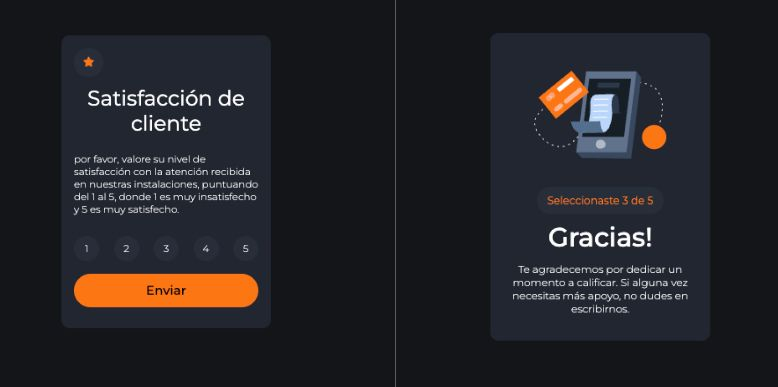
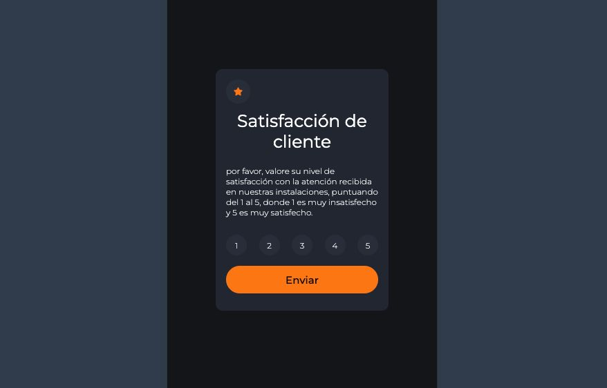

<h1 align=center>ENCUESTA DE SATISFACCIÓN</h1>

 

Este proyecto muestra una encuesta de satisfacción de clientes en la que el usuario tiene que marcar una puntuación y se le muestra un resultado de Gracias en conjunto con un agradecimiento y la puntuación que brindó.

 
 
 
 
 

<h2>Vista Escritorio</h2>

<h2>Vista Móvil</h2>
